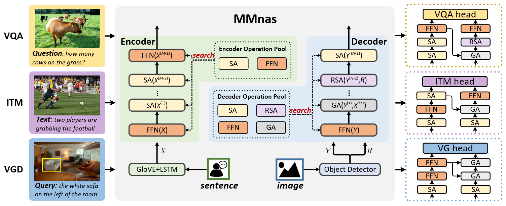

# MMNas: Deep Multimodal Neural Architecture Search
This repository corresponds to the **PyTorch** implementation of the MMnas for visual question answering (VQA), visual grounding (VGD), and image-text matching (ITM) tasks.
<p align="center">
	
</p>

## Prerequisites

### Software and Hardware Requirements

You may need a machine with at least **4 GPU (>= 8GB)**, **50GB memory for VQA and VGD** and **150GB for ITM** and **50GB free disk space**.  We strongly recommend to use a SSD drive to guarantee high-speed I/O.

You should first install some necessary packages.

1. Install [Python](https://www.python.org/downloads/) >= 3.6
2. Install [Cuda](https://developer.nvidia.com/cuda-toolkit) >= 9.0 and [cuDNN](https://developer.nvidia.com/cudnn)
3. Install [PyTorch](http://pytorch.org/) >= 0.4.1 with CUDA (**Pytorch 1.x is also supported**).
4. Install [SpaCy](https://spacy.io/) and initialize the [GloVe](https://github.com/explosion/spacy-models/releases/download/en_vectors_web_lg-2.1.0/en_vectors_web_lg-2.1.0.tar.gz) as follows:

	```bash
	$ pip install -r requirements.txt
	$ wget https://github.com/explosion/spacy-models/releases/download/en_vectors_web_lg-2.1.0/en_vectors_web_lg-2.1.0.tar.gz -O en_vectors_web_lg-2.1.0.tar.gz
	$ pip install en_vectors_web_lg-2.1.0.tar.gz
	```

## Dataset Preparations

Please follow the instructions in [`dataset_setup.md`](./docs/dataset_setup.md) to download the datasets and features.

## Search

To be finished.

## Training

The following script will start training with the default hyperparameters:

1. VQA

```bash
$ python3 run_vqa.py --RUN='train' --ARCH_PATH='./arch/run_vqa.json'
```

2. VGD

```bash
$ python3 run_vgd.py --RUN='train' --ARCH_PATH='./arch/run_vgd.json'
```

3. ITM

```bash
$ python3 run_itm.py --RUN='train' --ARCH_PATH='./arch/run_itm.json'
```

To add：

1. ```--VERSION=str```, e.g.```--VERSION='mmnas_vqa'``` to assign a name for your this model.

2. ```--GPU=str```, e.g.```--GPU='0, 1, 2, 3'``` to train the model on specified GPU device.

3. ```--NW=int```, e.g.```--NW=8``` to accelerate I/O speed.

<!-- 4. ```--SPLIT={'train', 'train+val', 'train+val+vg'}``` can combine the training datasets as you want. The default training split is ```'train+val+vg'```.  Setting ```--SPLIT='train'```  will trigger the evaluation script to run the validation score after every epoch automatically. -->

4. ```--RESUME``` to start training with saved checkpoint parameters.

5. ```--ARCH_PATH``` can use the different searched architectures.


## Validation and Testing

### Offline Evaluation

It's convenient to modify follows args: --RUN={'val', 'test'} --CKPT_PATH=[Your Model Path] to **Run val or test Split**.

Example:

```bash
$ python3 run_vqa.py --RUN='test' --CKPT_PATH=[Your Model Path] --ARCH_PATH=[Searched Architecture Path]
```

<!-- You can find all pretrained model in [`pretrained_models.md`](./pretrained_models.md). -->

### Online Evaluation (ONLY FOR VQA)

Test Result files will stored in ```./logs/ckpts/result_test/result_run_[Your Version].json```

You can upload the obtained result file to [Eval AI](https://evalai.cloudcv.org/web/challenges/challenge-page/163/overview) to evaluate the scores on *test-dev* and *test-std* splits.

## Pretrained Models

We provide the pretrained models in [`pretrained_models.md`](./docs/pretrained_models.md) to reproduce the experimental results in our paper.


## Citation

If this repository is helpful for your research, we'd really appreciate it if you could cite the following paper:

```
@article{yu2020mmnas,
  title={Deep Multimodal Neural Architecture Search},
  author={Yu, Zhou and Cui, Yuhao and Yu, Jun and Wang, Meng and Tao, Dacheng and Tian, Qi},
  journal={ACM Multimedia},
  year={2020}
}
```


